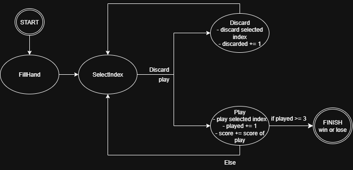

# Malatro - Juego de Cartas

- Lucas Poblete
- CC3002 Metodologias de Diseño y Programación
- Otoño 2025
- Departamento de Ciencias de la Computacion (DCC)
- Facultad de Ciencias Fisicas y Matematicas
- Universidad de Chile.

Malatro es una implementación en Scala de un juego de cartas estratégico basado en póquer, donde los jugadores juegan combinaciones de cartas, gestionan comodines especiales y buscan alcanzar un puntaje objetivo.

## 📋 Descripción General del Proyecto

Este proyecto está estructurado siguiendo principios de **programación orientada a objetos** y **patrones de diseño**, implementando:

- **Patrón State**: Para manejar los diferentes estados del juego
- **Patrón Observer**: Para notificar eventos importantes en el juego
- **Interfaces y clases abstractas**: Para garantizar extensibilidad y mantenibilidad

---

## 🏗️ Estructura del Proyecto

```
src/main/scala/model/
├── applyScore/
│   └── ApplyScore.scala
├── cards/
│   ├── Cards.scala
│   ├── Deck.scala
│   ├── ICards.scala
│   ├── pint/
│   │   ├── AbstractPint.scala
│   │   ├── Clubs.scala
│   │   ├── Diamonds.scala
│   │   ├── Hearts.scala
│   │   ├── Pint.scala
│   │   └── Spades.scala
│   └── range/
│       ├── AbstractRange.scala
│       ├── Range.scala
│       ├── even/
│       │   ├── Even.scala
│       │   ├── Eight.scala
│       │   ├── Four.scala
│       │   ├── Six.scala
│       │   ├── Ten.scala
│       │   └── Two.scala
│       ├── figure/
│       │   ├── Figure.scala
│       │   ├── Jota.scala
│       │   ├── King.scala
│       │   └── Queen.scala
│       └── odd/
│           ├── As.scala
│           ├── Five.scala
│           ├── Nine.scala
│           ├── Odd.scala
│           ├── Seven.scala
│           └── Three.scala
├── gameController/
│   ├── Discard.scala
│   ├── FillHand.scala
│   ├── Finish.scala
│   ├── GameController.scala
│   ├── GameState.scala
│   ├── Observer.scala
│   ├── Play.scala
│   ├── SelectIndex.scala
│   ├── Start.scala
│   ├── State.scala
│   └── Subject.scala
├── hand/
│   ├── Hand.scala
│   └── IHand.scala
├── jokers/
│   ├── AbstractJokers.scala
│   ├── DeviousJoker.scala
│   ├── EvenSteven.scala
│   ├── GreedyJoker.scala
│   ├── Jokers.scala
│   └── ScaryFace.scala
├── pokerComb/
│   ├── AbstractPokerComb.scala
│   ├── Flush.scala
│   ├── FourOfAKind.scala
│   ├── FullHouse.scala
│   ├── HighCard.scala
│   ├── Pair.scala
│   ├── PokerComb.scala
│   ├── Straight.scala
│   ├── StraightFlush.scala
│   ├── ThreeOfAKind.scala
│   └── TwoPair.scala
└── score/
    ├── IScore.scala
    └── Score.scala
```

---

## 🎴 Módulo de Cartas (`cards/`)

### Componentes Principales

#### **Interface `ICards`**
Define el contrato para todas las cartas del juego.

**Métodos:**
- `getRange(): Range` - Obtiene el valor/rango de la carta (A, 2-10, J, Q, K)
- `getPint(): Pint` - Obtiene la pinta de la carta (Corazones, Diamantes, Clubs, Picas)
- `equals(that: Any): Boolean` - Compara dos cartas
- `applyScore(score: IScore, jokers: List[Jokers]): IScore` - Aplica el valor de la carta al puntaje considerando comodines

#### **Clase `Cards`**
Implementación concreta de una carta.

```scala
val card = Cards(As(), Hearts())  // As de Corazones
```

#### **Object `Deck`**
Baraja completa del juego.

**Propiedades:**
- `cards`: Lista de todas las 52 cartas (13 valores × 4 pintas)
- `jokers`: Lista de comodines disponibles

**Métodos:**
- `drawCard(): ICards` - Extrae una carta aleatoria
- `drawJoker(): Jokers` - Extrae un comodín aleatorio

### Rango (Range)

**Interface `Range`** - Define los valores de las cartas:

**Tipos de Rango:**
- **Números pares**: Two, Four, Six, Eight (valor = número)
- **Números impares**: Three, Five, Seven, Nine (valor = número)
- **Figuras**: Jota, Queen, King (valor = 10)
- **As**: As (valor = 11)

**Propiedades:**
- `getName()`: Nombre de la carta
- `getOrder()`: Orden para detectar escaleras (1-13)
- `getValue()`: Chips base añadidos al puntaje
- `getTypeOfRange()`: Tipo de rango (Even, Odd, Figure, As)

### Pinta (Pint)

**Interface `Pint`** - Define los 4 pintas:

- **Hearts** (Corazones)
- **Diamonds** (Diamantes)
- **Clubs** (Clubs)
- **Spades** (Picas)

Las pintas pueden activar bonificaciones de comodines específicos.

---

## 🃏 Módulo de Mano del Jugador (`hand/`)

### **Interface `IHand extends Subject`**

Gestiona las cartas y comodines que el jugador tiene en su mano.

**Límites:**
- Máximo 8 cartas
- Máximo 2 comodines

**Métodos Principales:**

| Método | Descripción |
|--------|-------------|
| `getCards(): List[ICards]` | Obtiene la lista de cartas |
| `getJokers(): List[Jokers]` | Obtiene la lista de comodines |
| `addCard(card: ICards)` | Añade una carta a la mano |
| `removeCard(i: Int)` | Elimina una carta por índice |
| `addJoker(joker: Jokers)` | Añade un comodín a la mano |
| `removeJoker(i: Int)` | Elimina un comodín por índice |
| `play(indices: List[Int]): List[ICards]` | Juega cartas en los índices indicados (máx 3 veces, máx 5 cartas) |
| `discard(indices: List[Int])` | Descarta cartas (máx 3 veces, máx 5 cartas) |
| `detectCombination(): PokerComb` | Detecta la combinación de póquer en las cartas jugadas |
| `applyScore(): IScore` | Calcula el puntaje de la mano |
| `getPlayed(): Int` | Obtiene el número de veces que se han jugado cartas |
| `getDiscarded(): Int` | Obtiene el número de veces que se han descartado cartas |

### **Clase `Hand`**

Implementación concreta de la mano del jugador.

```scala
val hand = Hand(List(), List())
hand.addCard(card1)
hand.addCard(card2)
hand.addJoker(joker1)
val playedCards = hand.play(List(0, 1))  // Juega las cartas en índices 0 y 1
```

---

## 💰 Módulo de Puntuación (`score/`)

### **Interface `IScore`**

Define el sistema de puntuación.

**Fórmula:** `Puntuación Final = Chips × Multiplicador`

**Métodos:**
- `getChip(): Int` - Obtiene los chips base
- `getMulti(): Int` - Obtiene el multiplicador
- `getScore(): Int` - Obtiene la puntuación final (chips × multiplicador)
- `equals(that: Any): Boolean` - Compara dos puntuaciones

### **Clase `Score`**

Implementación concreta de puntuación.

```scala
val score = Score(50, 2)  // 50 chips, multiplicador 2 = 100 puntos
score.getScore  // 100
```

---

## 🎰 Módulo de Comodines (`jokers/`)

### **Interface `Jokers`**

Los comodines son cartas especiales que permanecen activas, modificando las reglas de puntuación.

**Métodos de Bonificación:**
- `getName(): String` - Nombre del comodín
- `applyScoreWithStraight(score: IScore): IScore` - Bonificación con escaleras
- `applyScoreWithDiamond(score: IScore): IScore` - Bonificación con diamantes
- `applyScoreWithEven(score: IScore): IScore` - Bonificación con números pares
- `applyScoreWithFigure(score: IScore): IScore` - Bonificación con figuras
- `equals(that: Any): Boolean` - Compara dos comodines

### **Clase Abstracta `AbstractJokers`**

Base para todos los comodines. Proporciona implementaciones por defecto que no modifican el puntaje.

### **Comodines Implementados**

1. **DeviousJoker**: Bonificación especial con figuras
2. **EvenSteven**: Bonificación con números pares
3. **GreedyJoker**: Bonificación general de chips
4. **ScaryFace**: Bonificación multiplicativa especial

Cada comodín puede tener diferentes efectos según el tipo de cartas jugadas.

---

## 🎯 Módulo de Combinaciones de Póquer (`pokerComb/`)

### **Interface `PokerComb`**

Define una combinación válida de póquer.

**Métodos:**
- `getName(): String` - Nombre de la combinación
- `getScore(): IScore` - Puntaje base de la combinación
- `verifyCards(listCards: List[ICards]): Boolean` - Verifica si una mano cumple con la combinación
- `applyScore(score: IScore, joker: Jokers): IScore` - Aplica bonificaciones del comodín
- `equals(that: Any): Boolean` - Compara dos combinaciones

### **Clase Abstracta `AbstractPokerComb`**

Base para todas las combinaciones de póquer.

### **Combinaciones Implementadas**

| Combinación | Puntaje Base | Descripción |
|------------|--------------|-------------|
| **High Card** | 5 chips × 1 mult | Carta más alta |
| **Pair** | 10 chips × 2 mult | Dos cartas del mismo valor |
| **Two Pair** | 20 chips × 2 mult | Dos parejas |
| **Three of a Kind** | 30 chips × 3 mult | Tres cartas del mismo valor |
| **Straight** | 30 chips × 4 mult | Cinco cartas en orden consecutivo |
| **Flush** | 35 chips × 4 mult | Cinco cartas del mismo pinta |
| **Full House** | 40 chips × 4 mult | Un trío + una pareja |
| **Four of a Kind** | 60 chips × 7 mult | Cuatro cartas del mismo valor |
| **Straight Flush** | 100 chips × 8 mult | Escalera del mismo pinta |

---

## 🎮 Módulo de Control del Juego (`gameController/`)

### **Patrón State (Máquina de Estados)**

El juego utiliza una máquina de estados para controlar el flujo del juego.

#### **Interface `GameState`**

Define las transiciones posibles entre estados.

**Métodos:**
- `play()` - Intenta jugar cartas
- `discard()` - Intenta descartar cartas
- `fillHand()` - Llena la mano con nuevas cartas
- `selectedIndex(indexes: String)` - Selecciona índices de cartas
- `finish()` - Termina el turno
- Métodos de consulta: `inPlay()`, `inDiscard()`, `inFillHand()`, etc.

### **Estados del Juego**

1. **Start**: Estado inicial del juego
2. **SelectIndex**: El jugador selecciona qué cartas jugar/descartar
3. **Play**: Ejecuta la jugada de cartas
4. **Discard**: Ejecuta el descarte de cartas
5. **FillHand**: Llena la mano con nuevas cartas del mazo
6. **Finish**: Termina el turno actual



### **Clase `GameController`**

Controlador principal del juego.

**Propiedades:**
- `hand: IHand` - Mano actual del jugador
- `score: Int` - Puntuación acumulada
- `scoreMin: Int` - Puntuación objetivo (1000)
- `state: GameState` - Estado actual
- `selectedIndex: List[Int]` - Índices seleccionados
- `bool: Boolean` - Indicador de si se alcanzó el límite de jugadas

**Métodos Principales:**
```scala
controller.play()              // Juega cartas seleccionadas
controller.discard()           // Descarta cartas seleccionadas
controller.fillHand()          // Llena la mano
controller.selectedIndex(indices) // Selecciona índices
controller.finish()            // Termina el turno
```

### **Patrón Observer**

La mano notifica al controlador cuando se alcanza el límite de 3 jugadas.

**Interface `Observer`**
```scala
trait Observer {
  def update(message: Boolean): Unit
}
```

**Interface `Subject`**
```scala
trait Subject {
  def subscribe(observer: Observer): Unit
  def unsuscribe(observer: Observer): Unit
  def notifyObservers(message: Boolean): Unit
}
```

---

## 🚀 Cómo Utilizar en una Implementación

### Ejemplo 1: Crear un Juego Simple

```scala
import model.gameController.GameController
import model.cards.Deck

// 1. Crear el controlador
val game = new GameController()

// 2. Llenar la mano inicial
for (_ <- 1 to 5) {
  game.hand.addCard(Deck.drawCard)
}

// 3. Agregar un comodín
game.hand.addJoker(Deck.drawJoker)

// 4. Mostrar la mano
println("Cartas: " + game.hand.getCards.map(c => 
  c.getRange.getName + " de " + c.getPint.getName
))
```

### Ejemplo 2: Jugar Cartas

```scala
// Seleccionar los índices de cartas a jugar
game.selectedIndex(List(0, 1))

// Cambiar a estado Play
game.play()

// Ver el puntaje acumulado
println("Puntaje: " + game.score)
```

### Ejemplo 3: Gestionar Turnos Completos

```scala
// Llenar la mano inicial
for (_ <- 1 to 5) {
  game.hand.addCard(Deck.drawCard)
}

// Turno 1: Jugar cartas
game.selectedIndex("0,1,2")  // Juega cartas en índices 0, 1, 2
game.play()

// Llenar la mano
game.fillHand()

// Turno 2: Descartar cartas
game.selectedIndex("3,4")    // Descarta cartas
game.discard()

// Llenar la mano de nuevo
game.fillHand()

// Terminar ronda
game.finish()

// Verificar si ganó
if (game.score >= game.scoreMin) {
  println("¡Victoria! Puntuación: " + game.score)
}
```

### Ejemplo 4: Trabajar con Combinaciones

```scala
// Crear una mano de prueba
val hand = new Hand(
  List(
    Cards(As(), Hearts()),
    Cards(Two(), Hearts()),
    Cards(Three(), Hearts()),
    Cards(Four(), Hearts()),
    Cards(Five(), Hearts())
  ),
  List()
)

// Detectar la combinación
val combo = hand.detectCombination()
println("Combinación: " + combo.getName)
println("Puntaje base: " + combo.getScore.getScore)

// Calcular puntaje con comodines
val score = hand.applyScore()
println("Puntaje final: " + score.getScore)
```

### Ejemplo 5: Usar Comodines

```scala
val hand = new Hand(List(), List())

// Agregar cartas y comodín
for (_ <- 1 to 5) {
  hand.addCard(Deck.drawCard)
}
hand.addJoker(new EvenSteven())

// El comodín EvenSteven da bonificación con números pares
val cardsPlayed = hand.play(List(0, 1, 2))
val baseScore = new Score(50, 1)

// El comodín modificará el puntaje si hay números pares
val finalScore = cardsPlayed(0).applyScore(baseScore, hand.getJokers)
println("Puntaje con comodín: " + finalScore.getScore)
```

---

## 🧪 Ejecución de Pruebas

```bash
sbt test
```
O presionando `MUnit in 'scala'` desde IntelliJ

El proyecto incluye pruebas unitarias para validar:
- Creación y manipulación de cartas
- Gestión de la mano del jugador
- Detección de combinaciones de póquer
- Cálculo de puntuación
- Transiciones de estados

---

## 🔧 Requisitos

- **Scala 3.3.3**
- **SBT** (Scala Build Tool)
- **MUnit** para testing

---

## 📝 Notas Importantes

1. **Límites de la Mano**: Máximo 8 cartas y 2 comodines
2. **Límites de Jugadas**: Se pueden jugar cartas máximo 3 veces por turno
3. **Límite de Cartas**: Se pueden jugar máximo 5 cartas por jugada
4. **Puntuación Mínima**: Se necesita alcanzar 1000 puntos para ganar
5. **Descarte**: Se pueden descartar máximo 5 cartas, máximo 3 veces por turno

---

## 📚 Estructura de Pruebas

Las pruebas están organizadas en `src/test/scala/model/` con la misma estructura que el código principal para facilitar su mantenimiento.

---

## 🎓 Conceptos de Programación Utilizados

- **Programación Orientada a Objetos**: Clases, interfaces, herencia
- **Patrones de Diseño**: State, Observer
- **Functional Programming**: Uso de `map`, `filter`, `fold`
- **Type Safety**: Sistema de tipos fuerte de Scala
- **Immutability**: Donde es posible, usar datos inmutables

---

<div style="text-align:center;">
    
</div>

This project is licensed under the [Creative Commons Attribution 4.0 International License](http://creativecommons.org/licenses/by/4.0/).

Derivado de [malatro-luckmpt](https://github.com/dcc-cc3002/malatro-luckmpt) por CC3002 del DCC.

---